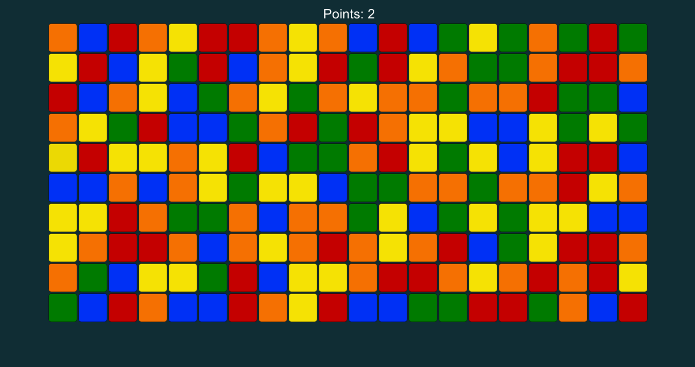

# Match11

A simple tile matching puzzle. Get it here: <a href="https://github.com/broxp/Match11/archive/master.zip">Repo as ZIP</a>

<a href="https://the-faction-conflict.tumblr.com/">the-faction-conflict.tumblr.com</a>

<pre>
test chamber system                                 -A-
	temporary items (only during this level)

mmo like / rpg / dungeons / specific loot           -B-
	story telling

sci fi setting                                      >C<
	heroes, factions, team a vs b, 1 hero / faction
	hero ability (unlock more?)
	-> synergy with main stat of faction
	stats: pirates     - agility / speed
	       alliance    - shields
	       mechanists  - weapons
	       scientists  - effective weapons, hacking?

game play
	collect resources/loyalty/points
	--> activate skills / permanent effects (costs)
	hit points / damage?
	crew / ship battle
	focus on certain color (1 at start, 2, 3 later on)
	steps: load gun challenge, charge shot challenge,
	       missile steering challenge,
	       repair challenge, energy shield challenge,
	       dodge challenge

competition
	relaxed mode / arcade mode?
	multiplayer
		coop mode
		vs mode
			vote against items before level
				=> or choose item balancing (incl all)
		on special clearing => effect on other player
		tetris => inserts rows from bottom
	highscore
		regional rank (world europe germany sh kiel)
	lvl not randomly generated
		=> best solution (minimal steps / par)
		=> timing

online play => lobby (global)
	skill level? matchmaking (items? rank?)
	empty lobby?

invite function
	email, telnumber

level up => reward / achievements

(money)
	shop? (no item shop if choosable items?)
	ad? (watch to replenish lives, const. displ)
	lifes?
	themes / skins? (setting / story? fun skins?)
	avatar / characters / heroes? (mash up / cross over)
		ip? or generic characters
		unlocking or buy heroes?
		balancing?
		loot boxes / boosters
	level unlocks?
</pre>
